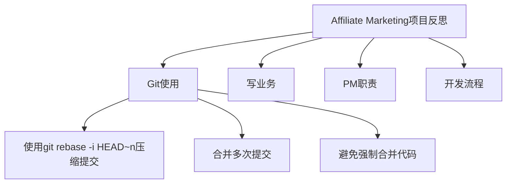

```mermaid
graph TD
    A[Affiliate Marketing项目反思] --> B[Git使用]
    A --> C[写业务]
    A --> D[PM职责]
    A --> E[开发流程]

    B --> 1[使用git rebase -i HEAD~n压缩提交]
    B --> B2[合并多次提交]
    B --> B3[避免强制合并代码]

```