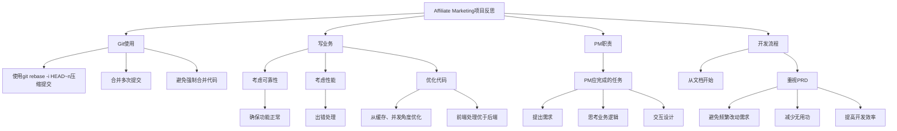

```mermaid
graph TD
    A[Affiliate Marketing项目反思] --> B[Git使用]
    A --> C[写业务]
    A --> D[PM职责]
    A --> E[开发流程]
    B --> B1[使用git rebase -i HEAD~n压缩提交]
    B --> B2[合并多次提交]
    B --> B3[避免强制合并代码]

    C --> C1[考虑可靠性]
    C --> C2[考虑性能]
    C1 --> C1a[确保功能正常]
    C2 --> C2a[出错处理]
    C --> C3[优化代码]
    C3 --> C3a[从缓存、并发角度优化]
    C3 --> C3b[前端处理优于后端]

    D --> D1[PM应完成的任务]
    D1 --> D1a[提出需求]
    D1 --> D1b[思考业务逻辑]
    D1 --> D1c[交互设计]

    E --> E1[从文档开始]
    E --> E2[重视PRD]
    E2 --> E2a[避免频繁改动需求]
    E2 --> E2b[减少无用功]
    E2 --> E2c[提高开发效率]

```